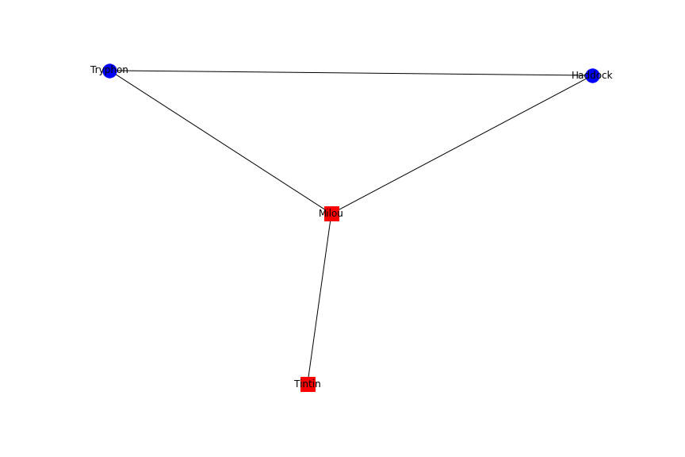

# tp-interactomics


## Contexte biologique

Nous allons reproduire certaines analyses rapportées dans une étude du réseau d'interaction des protéines du [virus d'Epstein-Bar](https://en.wikipedia.org/wiki/Epstein%E2%80%93Barr_virus) avec certaines protéines de son hôte principal l'homme ([Calderwood et al.](https://www.pnas.org/content/104/18/7606)). Le cible cellulaire principale du virus EBV est lymphocyte B humain.  

## Mise en place
Vous commencerez par "fourcher" et cloner ce repository.
Seul Jupyter avec la librarire [networkx](https://networkx.org/) est requis.
Les libraries Pandas et request peuvent également être utilisées.
A l'exception des encarts du présent `README` prévus à cet effet, il vous est conseillé de réaliser le TP dans un notebook Jupyter que vous joindrez à ce répository git en fin de séance.

### Données

#### Protéomiques

Les fiches UNIPROT des protéines étudiées dans la publication sont disponibles dans fichiers XML suivants:

- `data/Calderwood_EBV_proteome.xml`
- `data/Calderwood_Human_proteome.xml`

#### Interactomiques

Nous allons devoir recupérer les données d'interactions étudiées dans la publication grâce au protocole [PSICQUIC](https://psicquic.github.io/PsicquicSpec_1_4_Rest.html).

Ce protocole permet l'accès à distance à de nombreuses bases de données d'interactions protéine-protéine. Les interactions présentes dans ces bases de données sont obtenues par curation minutieuse de la littérature scientifique. Les interactions sont uniquement binaires (2 protéines) et toujours associées à la publication d'origine.
D'autres informations peuvent également être rapportées.
Le format standard de PSICQUIC, tabulé, est nommé [MITAB](https://psicquic.github.io/PSIMITAB.html).
Les requêtes sont formulées aux bases de données à l'aide d'un protocole REST obéissant à la syntaxe [MIQL](https://psicquic.github.io/MiqlReference.html)

Pour ce TP nous utiliserons la bases de données [Intact](https://www.ebi.ac.uk/intact/), dont le service PSICQUIC est accessible à l'URL: `http://www.ebi.ac.uk/Tools/webservices/psicquic/intact/webservices/current/search`.
Par exemple, les 100 premières interactions protéine-protéine humaines disponibles dans Intact sont accessibles via l'URL: `http://www.ebi.ac.uk/Tools/webservices/psicquic/intact/webservices/current/search/query/species:human?firstResult=0&maxResults=100`

##### Quelles sont les significations des champs suivants du format MITAB 2.X?

Numero de champ | Signification Biologique|
 --- | --- 
1 | 
2 |
3 |
4 |
5 |
6 |

##### Utiliser le PMID de la publication pour récuperer les lignes MITAB des interactions rapportées dans l'étude.
Une librairie pratique pour manipuler des requêtes HTTP est [requests](https://requests.readthedocs.io/en/master/), eg:

```python
import requests
url = "https://mmsb.cnrs.fr/equipe/mobi/"

try:
    httpReq = requests.get(url, proxies=None)
except NameError:
    httpReq = requests.get(url)
ans = httpReq.text
```

##### Quelles techniques experimentales mesurent les interactions rapportées dans cette publication?

```

```

#### Extraction des deux sous-jeux d'interactions

Vous disposez d'un code écrit par votre collègue pour extraire à partir d'un chaîne de caractères au format mitab les lignes concertant:

- Les interactions EBV-EBV
- Les interactions EBV-Humaine

Malheuresement, votre collègue a du partir en urgence. Vous devez comprendre et compléter son code pour mener à bien l'extraction des deux jeux d'interactions.

```python
import re

def mitabReader(httpText):
    for line in ans.split("\n"):
        _ = line.split("\t")
        if len(_) > 1 and _[0].startswith("uniprotkb:")\
                      and _[1].startswith("uniprotkb:"):
            yield [ _[0].replace("uniprotkb:", ""),\
                    _[1].replace("uniprotkb:", "") ]\
                  + _[2:]
                
            
def isMitab_EBV_EBV(mitabArray):
    reEBV   = "taxid:(1037[6-7]|82830)"
    if re.search(reEBV, mitabArray[9]) and re.search(reEBV, mitabArray[10]):
        return True
    return False

def isMitab_Human_EBV(mitabLine):
    # Je ferai ça plus tard
    return False


EBV_EBV_mitab   = []
EBV_Human_mitab = []
total = 0
for mitabArray in mitabReader(ans):
    total += 1
    if isMitab_EBV_EBV(mitabArray):
        EBV_EBV_mitab.append(mitabArray)
    elif isMitab_Human_EBV(mitabArray):
        EBV_Human_mitab.append(mitabArray)
    else : 
        raise ValueError("Je ne connais pas cette espece ==> ", mitabArray[9:11])

print(f"Nombre total d'interactions {total}, EBV-EBV {len(EBV_EBV_mitab)}")
```

##### Que fait la fonction `mitabReader` ?
```
```

##### Après avoir réparé ce code veuillez
- Extraire les lignes MITAB impliquant uniquement des protéines d'EBV, quel est leur nombre ?
- Extraire les lignes MITAB impliquant des protéines humaines et des protéines d'EBV, quel est leur nombre ?
```
```

##### Combien de protéines humaines et virales sont respectivement dans les jeux d'interactions EBV-Human et EBV-EBV ?

```

```

###### Pour la suite du travail assurez-vous d'avoir les deux jeux de données MITAB suivants

- MITAB EBV/EBV
- MITAB EBV/Human

Chacun ne contetant que des interactants référés par un numéro d'accession UNIPROT

### Construction du réseau d'interactions EBV/EBV

A l'aide des données MITAB et de la librarie [networkx](https://networkx.github.io/documentation/latest/
), représentez graphiquement un réseau dans lequel:

- les noeuds sont des identifiants UNIPROT

- les arêtes relient deux protéines en interaction


##### Décrivez brièvement ce réseau

```

```

Les noms de gènes sont parfois plus parlants que des accesseurs UNIPROT. A l'aide du fichier `./data/Calderwood_EBV_proteome.xml`  créez une table de conversion entre accesseur UNIPROT et nom de gène.

Pour vous aidez dans cette tâche, vous disposez du "parser" XML suivant qui étant donné un numéro d'accession UNIPROT et un document XML retourne un dictionaire d'informations concernant cette protéine. Le code permettant d'extraire l'information du nom de gène à été supprimée lors d'un `git push` malencontreux, à vous de le completer avant utilisation.

```python
from xml.etree.ElementTree import parse, dump, fromstring, register_namespace, ElementTree

# Utility functions
# Extracting All go terms relative to provided UNIPROT accessor
def goTerms(xmlEntry):
    ns = '{http://uniprot.org/uniprot}'
    goTerms = xmlEntry.findall(ns +'dbReference[@type="GO"]')
    goTermList = []
    for goT in goTerms:
        gID   = goT.attrib['id']
        gName = goT.find(ns +'property[@type="term"]').attrib['value']
        goTermList.append({"name" : gName, "ID" : gID})
    return goTermList

# Return information about provided UNIPROT accessor as python dictionary
def proteinDict(uniprotID, root):
    ns   = '{http://uniprot.org/uniprot}'

    data = { "accession" : uniprotID,
             "geneName" : None,
             "name" : None,
             "GOterms" : None
           }

    for entry in root.findall(ns+'entry'):
        accessions = entry.findall(ns+"accession")
        for acc in accessions:
            if acc.text == uniprotID: # entry is the node matching provided UNIPROT accessor
                e = entry.find(f"{ns}protein/{ns}recommendedName/{ns}fullName")
                if not e is None:
                    data["name"] = e.text
                e = "OUPSS##!!!"
                if not e is None:
                    data["geneName"] = e.text

                data["GOterms"] = goTerms(entry)
                return data
    raise ValueError(f"{uniprotID} nor found in XML document")
```

Vérifier votre réparation du code en l'appliquant au test ci-dessous.

```python
# Test
tree = parse('./data/Calderwood_Human_proteome.xml')
root = tree.getroot()
proteinDict("Q53Y88", root)
```

###### Convertir les noms des protéines
Pour convertir tous les noms des noeuds du réseau en noms de gènes, il vous est demandé de construire à l'aide de la fonction `proteinDict()` précédente un dictionaire dans lequel les couples `{clé, valeur}` sont les `{ identifiant_uniprot, nom_de_gène}` .

Par chance, un code produit par un encadrant bienveillant est disponible !

```python
import re

def geneNameDictFromMitab(mitab, xmlRoot, reTAXID="taxid:(1037[6-7]|82830)"):
    """ Extract geneNames from provided xmlHandler
        It defaults to uniprotID if geneName is not found
        Returns a dict of key,value = UNIPROTID, GeneName || UNIPROTID
    """
    nodeLabels = {}
    for d in mitab:
        for i,uniprotID in enumerate(d[:2]):
            if re.search(reTAXID, d[i + 9]):
                if not uniprotID in nodeLabels:
                    protData = proteinDict(uniprotID, xmlRoot)
                    nodeLabels[uniprotID] = protData['geneName']\
                                             if protData['geneName']\
                                             else uniprotID
    return nodeLabels

tree = parse('./data/Calderwood_EBV_proteome.xml')
root = tree.getroot()
EBV_node_label = geneNameDictFromMitab(EBV_EBV_mitab, root)
```

Il est malheureusement cassant comme le démontre l'exemple 

```python
tree = parse('./data/Calderwood_Human_proteome.xml')
root = tree.getroot()
EBV_Human_node_label = geneNameDictFromMitab(EBV_Human_mitab, root)
```

Proposer une amélioration du code et produisez ensuite deux dictionaires de conversion:

- nodeLabelEBV_dict  
- nodeLabelHuman_dict

Il est possible de dessiner noeuds, arêtes et labels séparemment. Comme dans l'exemple suivant:

```python
plt.figure(figsize=(12, 8))# Set overall figure size

G = nx.Graph()

for data in [("x", "y"), ("j", "k"), ("y","j"), ("k","y")]:
    G.add_edge(data[0], data[1])
    
name_map = {
    "x" : "Tintin", "y" : "Milou",
    "j" : "Tryphon", "k" : "Haddock"
}
liste1=["x", "y"]
liste2=["j", "k"]

# Compute layout then draw on it
pos = nx.spring_layout(G)
# node shapes are registred here : https://matplotlib.org/stable/api/markers_api.html
nx.draw_networkx_nodes(G, pos, liste1, node_color='red', node_shape='s')
nx.draw_networkx_nodes(G, pos, liste2, node_color='blue', node_shape='o' )
nx.draw_networkx_edges(G, pos)
nx.draw_networkx_labels(G, pos, labels=name_map, font_size=12)

plt.show()
```



Vous pouvez desormais dessiner le réseau dans lequel des interactions **EBV**:

- les arêtes relient deux protéines en interaction
- les noeuds sont les noms des gènes correspondant aux protéines.

### Caractérisation des cibles protéiques du virus

Pour perturber et détourner à son profit le fonctionnement du lymphocyte, le matériel protéique du virus va interagir préferentiellement avec certains processus cellulaires.

En suivant, la méthode précédente dessiner le réseau dans lequel:

- les arêtes relient une protéine humaine et une protéine virale en interaction.
- les noeuds sont les noms des gènes correspondant aux protéines.
- les noeuds des protéines virales et humaines sont dessinés différement.

Vous pouvez jouer sur la taille de la figure et la constante de ressort *k* du rendu [spring_layout](https://networkx.org/documentation/stable/reference/generated/networkx.drawing.layout.spring_layout.html) pour augmenter la lisibilité du graphique


## Analyse des interactions entre protéines humaines avec STRING

Maintenant que vous avez pu visualiser le réseau des interactions physiques virus/homme, vous allez utiliser la ressource STRING pour visualiser les interactions entre les protéines humaines ciblées par le virus.

Comme décrit dans la publication, 173 interactions virus/homme ont été observées, impliquant 112 protéines humaines.


### Representation des interactions avec STRING

Aller sur le site de [STRING](string-db.org), et afficher les interactions entre les 112 protéines humaies ciblées par le virus:

1. Aller dans *Search*
2. puis *Multiple proteins*
3. charger le fichier human_proteins_unique.txt, en spécifiant l'organisme *Homo Sapiens*,
4. valider les protéines identifiées par STRING (en cliquant sur *Continue*).

Par défaut, STRING affiche les interactions avec tous les canaux, a partir d'un indice de confiance 'moyen', c'est a dire supérieur a 0.4.
Nous allons conserver ces paramètres par défaut.

## Simplification du réseau

Nous allons essayer d'exploiter ce réseau pour mettre en évidence les voies fonctionnelles ciblées par le virus.

Afin de simplifier l'analyse, éliminer les protéines non connectées au reste du réseau:
Aller dans Settings, Advanced Settings, network display options: hide disconnected nodes in the network.

Que pouvez-vous dire de la structure de ce réseau ?
Combien de 'modules' (= clusters) semble-t-il y avoir ?

Confirmez votre interprétation en vous aidant de l'outil de clustering de STRING.
Uploadez une image du réseau coloré qui vous semble le mieux représenter sa structure interne.


## Identification des voies fonctionnelles

Pour les deux clusters principaux, naviguez dans les annotations des protéines, et essayez de proposer des hypothèse quand au mécanisme d'action de EBV, en expliquant votre démarche.

(Toutes les hypothèses sont intéressantes si vous expliquez votre façon de faire).

```
```

Comment procéderiez-vous si vous deviez faire cette analyse de manière plus rigoureuse ?

```

```


## Questions Optionelles

Les noeuds du réseau d'interaction peut aussi être divisés en deux partitions, humaine et virale. Vous disposez, ci-dessous d'un exemple de rendu graphique "bipartite" sur deux selections arbitraires de noeuds. Essayez de l'adapter au problème de représentation graphique du réseau d'interaction EBV/Humain

```python
import networkx as nx
plt.figure()
plt.axis('off')

G = nx.Graph()
G.add_edge("A", "C")
G.add_edge("B", "C")
X, Y = nx.bipartite.sets(G,  ["A", "B"])
pos = nx.bipartite_layout(G, X)
nx.draw_networkx_nodes(G, pos, node_color="blue", node_shape="o",nodelist=["A", "B"] )
nx.draw_networkx_nodes(G, pos, node_color="red", node_shape="o",nodelist=["C"] )
nx.draw_networkx_labels(G,pos,font_weight=800,font_color='black')
nx.draw_networkx_edges(G, pos, width=0.5)
```

##### Propriétés topologiques des protéines humaines ciblées par le virus

Les paires connues de protéines humaines en interaction sont disponibles dans le fichier `data/human_interactome_pair_uniprot.tab.gz`.

* Construisez l'objet `networkx.Graph` stockant ces interactions.
* Dessinez l'histogramme multiple des distributions des degrés dans cet objet réseau pour les deux populations de protéines suivantes:
   - Protéines humaines ciblées par EBV
   - Protéines humaines totales


Qu'observez vous ?
```
```

##### Identification des processus biologiques ciblés par le virus

Nous allons observés les termes GO présents dans les protéines humaines les plus ciblées par EBV

1. Classer les noeuds, protéines humaines, par degré décroissant.
2. Lister les termes GO des protéines les plus connectées

- Quels termes reviennent fréquemment?

```

```

- Connaissant l'organisation de l'ontologie GO, quelles suggestions pourriez vous faire afin d'augmenter la qualité de l'analyse?

```

```
